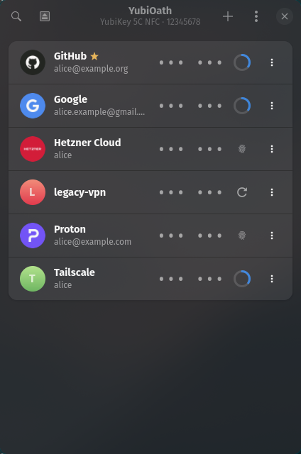
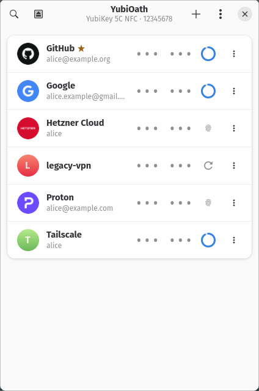

#  YubiOath

OATH one-time passwords (TOTP/HOTP) from a YubiKey, in a small GTK4 + libadwaita
window. A Linux-native replacement for the OTP part of Yubico Authenticator.

[](https://github.com/felsenuboot/yubioath-gtk/actions/workflows/ci.yml)
[](https://github.com/felsenuboot/yubioath-gtk/actions/workflows/codeql.yml)

<p align="center">
  
  
</p>

- Lists the accounts stored on the key, shows TOTP codes with a countdown ring
- Click a row to copy the code; touch-required and HOTP accounts calculate on click
- Favorites pinned to the top; issuer logos from Aegis-format icon packs
- Password-protected keys: unlock once, optionally remember in the system keyring;
  set, change or remove the password; reset the OATH applet
- Add accounts from an `otpauth://` URI, a QR code on screen (grim + zbarimg), or by hand
- Rename and delete accounts, search with Ctrl+F
- Device info page; switch between several connected keys
- Preferences: theme override, hide codes until clicked, clear clipboard after a delay
- Tray icon with the accounts in a menu: click one to copy its code without
  opening the window; optional close-to-tray and start hidden
- Follows the system light/dark theme and accent colour

Talks to the key directly through [yubikey-manager](https://github.com/Yubico/yubikey-manager)
(`yubikit`) over PC/SC. No background service of its own.

> [!NOTE]
> **Status and disclaimer.** This is a personal project, written largely with
> Claude Code and reviewed by a human, but not audited. It works on my machine
> (Arch, Hyprland, YubiKey 5). Use at your own risk; there is no warranty.
> Issues and pull requests are welcome.

**Security notes.** The app never sees or stores your OTP secrets; they stay on
the YubiKey, which computes every code. The only thing it can persist is the
key derived from your OATH password, and only if you tick "Remember on this
computer", in which case it goes to the system keyring via libsecret. The app
holds the smart card connection only for the duration of each operation.

## Requirements

Python ≥ 3.11, GTK ≥ 4.14, libadwaita ≥ 1.6, PyGObject, libsecret,
[yubikey-manager](https://github.com/Yubico/yubikey-manager) ≥ 5.5 (the
`ykman` Python package), and a running pcscd with the CCID driver.

```sh
# Arch
sudo pacman -S --needed yubikey-manager ccid python-gobject gtk4 libadwaita libsecret
sudo systemctl enable --now pcscd.socket

# Debian / Ubuntu (24.04+ has libadwaita 1.5 only; use pip for ykman)
sudo apt install pcscd python3-gi gir1.2-gtk-4.0 gir1.2-adw-1 gir1.2-secret-1 pipx
pipx install yubikey-manager

# Fedora
sudo dnf install pcsc-lite ccid python3-gobject gtk4 libadwaita libsecret yubikey-manager
sudo systemctl enable --now pcscd.socket
```

Optional: `grim` + `zbar` for "Scan QR code on screen" (wlroots/Hyprland),
`wl-clipboard` for copying from the tray on sway and other compositors that
validate the input serial. The "service not running" page shows the commands
for your distro.

## Install / run

```sh
./install.sh        # symlinks bin/yubioath-gtk into ~/.local/bin, installs .desktop + icon
yubioath-gtk
```

Or run from the checkout without installing: `python -m yubioath_gtk`.

Environment variables: `YUBIOATH_DEBUG=1` for verbose logging,
`YUBIOATH_FAKE=1` to run with fake accounts and no hardware (UI development);
add `YUBIOATH_OPEN=<action>` (e.g. `preferences`, `device-info`, `password`) to
open a dialog on launch.

Icon packs: download the `.zip` from
[aegis-icons releases](https://github.com/aegis-icons/aegis-icons/releases) and
pick it in Preferences.

## Hyprland

The window's app id is `io.github.felsenuboot.YubiOath`. To keep it as a small
floating window, add to your config (Lua config, Hyprland 0.56):

```lua
hl.window_rule({
    name = "yubioath",
    match = { class = "io.github.felsenuboot.YubiOath" },
    float = true,
    center = true,
    size = "420 640",
})
```

Add `pin = true` if it should stay visible on every workspace.

## Tray icon

GTK4 has no tray widget, so YubiOath implements the StatusNotifierItem and
DBusMenu protocols itself. Any bar with a tray that speaks them shows the icon:
waybar's `tray` module, Quickshell, KDE Plasma, and others. GNOME needs an
AppIndicator extension.

The menu lists your accounts, favorites first. Clicking one copies the current
code; touch-required and HOTP accounts are calculated first. Feedback that would
normally be a toast becomes a desktop notification while the window is hidden
or unfocused, including the "Touch your YubiKey" prompt. A hidden window does
not poll the key.

Preferences has three switches: **Show tray icon**, **Close to tray** (the
window hides instead of quitting; use the menu's Quit or Ctrl+Q) and **Start
hidden**. If no tray host is running, the icon simply does not appear and a
second launch brings the window back.

Copies made from the tray go through `wl-copy` when it is installed, because
compositors that validate the Wayland input serial (sway, other wlroots based
ones) drop clipboard writes from an unfocused window. Hyprland accepts them
either way.

## Keyboard

| Shortcut | Action |
|---|---|
| Ctrl+F | Search; Enter copies the first match |
| Ctrl+N | Add account |
| Ctrl+I | Device info |
| Ctrl+, | Preferences |
| F5 / Ctrl+R | Refresh |
| Ctrl+W | Close the window (hides it when "Close to tray" is on) |
| Ctrl+Q | Quit |

## Development

```sh
pipx install ruff pytest          # or your distro's packages
ruff check . && ruff format --check .
pytest
YUBIOATH_FAKE=1 python -m yubioath_gtk   # UI without hardware
```

Work happens on branches, one per issue, merged into `master` through a pull
request once CI (ruff, pytest, pip-audit, CodeQL) is green; `master` is
protected accordingly. Issues are grouped into
[milestones](https://github.com/felsenuboot/yubioath-gtk/milestones), each
milestone ends in a tag `vX.Y.Z` and a GitHub release whose notes come from
[CHANGELOG.md](CHANGELOG.md). Versions stay at 0.x while the feature set is
still moving. The version number lives only in `pyproject.toml`.

## License

MIT. Not affiliated with Yubico; YubiKey is a trademark of Yubico AB.
