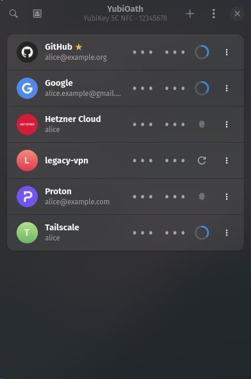
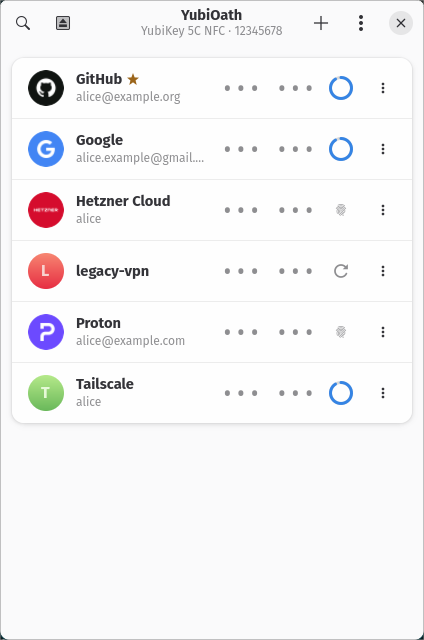

<div align="center">
  
  <h1>YubiOath</h1>
  <p>YubiKey one-time passwords for GNOME</p>
  <a href="https://github.com/felsenuboot/yubioath-gtk/actions/workflows/ci.yml"></a>
  <a href="https://github.com/felsenuboot/yubioath-gtk/actions/workflows/codeql.yml"></a>
  <a href="https://github.com/felsenuboot/yubioath-gtk/releases"></a>
</div>

YubiOath shows the OATH one-time passwords (TOTP and HOTP) stored on a
YubiKey, in a small GTK 4 and libadwaita window. It is a Linux-native
replacement for the OTP part of Yubico Authenticator: it talks to the key
directly through [yubikey-manager](https://github.com/Yubico/yubikey-manager)
over PC/SC, with no background service of its own.

<p align="center">
  
  
</p>

> [!NOTE]
> A personal project, written largely with Claude Code and reviewed by a
> human, not audited. It works on my machine (Arch, Hyprland, YubiKey 5). No
> warranty; not affiliated with Yubico.

## Features

- 🔢 **Codes.** The accounts on the key as a list, TOTP codes with a countdown
  ring; click a row to copy. Touch-required and HOTP accounts calculate on
  click, with a "Touch your YubiKey" prompt.
- ⭐ **Favorites.** Pinned to the top of the list and of the tray menu.
- 🖼️ **Issuer logos.** From Aegis-format icon packs; e-mail style account
  names match on every domain label.
- 🔒 **Password.** Unlock a protected key once, optionally remember it in the
  system keyring; set, change or remove the password; reset the OATH applet.
- ➕ **Add accounts.** From an `otpauth://` URI, a QR code on screen
  (grim + zbarimg) or by hand, with 6/7/8 digits and any period the key
  accepts.
- ✏️ **Manage.** Rename and delete accounts, search with Ctrl+F.
- 🔑 **Several keys.** Device info page; switch between connected keys.
- 📋 **Tray icon.** The accounts in a menu: click one to copy its code without
  opening the window; close to tray and start hidden.
- 🎛️ **Preferences.** Theme override, hide codes until clicked, clear the
  clipboard after a delay.
- 🎨 **Desktop.** Follows the system light/dark theme and accent colour;
  keyboard shortcuts for everything.

## Install

Python 3.11+, PyGObject, GTK 4.14+, libadwaita 1.6+,
[yubikey-manager](https://github.com/Yubico/yubikey-manager) 5.5+ (the
`ykman` Python package), and a running pcscd with the CCID driver. libsecret
is optional: without it (or the `keyring` package) the app runs but cannot
remember the OATH password.

| Distribution | Packages |
| --- | --- |
| Arch | `yubikey-manager ccid python-gobject gtk4 libadwaita libsecret` |
| Fedora | `pcsc-lite ccid python3-gobject gtk4 libadwaita libsecret yubikey-manager` |
| Debian, Ubuntu | `pcscd python3-gi gir1.2-gtk-4.0 gir1.2-adw-1 gir1.2-secret-1 pipx`, then `pipx install yubikey-manager` (24.04 ships libadwaita 1.5 only) |

```
sudo systemctl enable --now pcscd.socket
git clone https://github.com/felsenuboot/yubioath-gtk.git
cd yubioath-gtk
./install.sh
```

This symlinks the launcher into `~/.local/bin` and adds the desktop entry and
icon for your user. The launcher runs from the checkout, so `git pull` is the
whole update. `python -m yubioath_gtk` runs it without installing anything.

**Optional.** `grim` and `zbar` for "Scan QR code on screen" (wlroots and
Hyprland), `wl-clipboard` for copying from the tray on sway and other
compositors that validate the input serial. If pcscd is not running, the app
shows the commands for your distribution.

**Icon packs.** Download the `.zip` from
[aegis-icons releases](https://github.com/aegis-icons/aegis-icons/releases)
and pick it in Preferences.

**Environment.** `YUBIOATH_DEBUG=1` for verbose logging, `YUBIOATH_FAKE=1`
for fake accounts and no hardware (UI development), `YUBIOATH_OPEN=<action>`
(`preferences`, `device-info`, `password`) to open a dialog on launch.

## Tray icon

GTK 4 has no tray widget, so YubiOath implements the StatusNotifierItem and
DBusMenu protocols itself. Any bar with a tray that speaks them shows the
icon: waybar's `tray` module, Quickshell, KDE Plasma, and others. GNOME needs
an AppIndicator extension. If no tray host is running, the icon simply does
not appear and a second launch brings the window back.

The menu lists your accounts, favorites first. Clicking one copies the
current code; touch-required and HOTP accounts are calculated first. Feedback
that would normally be a toast becomes a desktop notification while the
window is hidden or unfocused, including the "Touch your YubiKey" prompt. A
hidden window does not poll the key.

Preferences has three switches: **Show tray icon**, **Close to tray** (the
window hides instead of quitting; use the menu's Quit or Ctrl+Q) and **Start
hidden**.

Copies made from the tray go through `wl-copy` when it is installed, because
compositors that validate the Wayland input serial (sway, other wlroots based
ones) drop clipboard writes from an unfocused window. Hyprland accepts them
either way.

## Hyprland

The window's app id is `io.github.felsenuboot.YubiOath`. To keep it as a
small floating window, add to your config (Lua config, Hyprland 0.56):

```lua
hl.window_rule({
    name = "yubioath",
    match = { class = "io.github.felsenuboot.YubiOath" },
    float = true,
    center = true,
    size = "420 640",
})
```

Add `pin = true` if it should stay visible on every workspace.

## Keyboard

| Shortcut | Action |
| --- | --- |
| Ctrl+F | Search; Enter copies the first match |
| Ctrl+N | Add account |
| Ctrl+I | Device info |
| Ctrl+, | Preferences |
| F5 / Ctrl+R | Refresh |
| Ctrl+W | Close the window (hides it when "Close to tray" is on) |
| Ctrl+Q | Quit |

## Security

The app never sees or stores your OTP secrets; they stay on the YubiKey,
which computes every code. The only thing it can persist is the key derived
from your OATH password, and only if you tick "Remember on this computer",
in which case it goes to the system keyring. The smart card connection is
held only for the duration of each operation.

## Contributing

Bug reports, ideas and pull requests: the
[issue tracker](https://github.com/felsenuboot/yubioath-gtk/issues). Issues
are grouped into [milestones](https://github.com/felsenuboot/yubioath-gtk/milestones);
each milestone ends in a tag `vX.Y.Z` and a GitHub release whose notes come
from [CHANGELOG.md](CHANGELOG.md). Versions stay at 0.x while the feature
set is still moving.

```
pipx install ruff pytest          # or your distro's packages
ruff check . && ruff format --check .
pytest
YUBIOATH_FAKE=1 python -m yubioath_gtk   # UI without hardware
```

Work happens on branches, one per issue, merged into `master` through a pull
request once CI (ruff, pytest, pip-audit, CodeQL) is green; `master` is
protected accordingly. The version number lives only in `pyproject.toml`.

## Licence

MIT licence, see [LICENSE](LICENSE). Not affiliated with Yubico; YubiKey is
a trademark of Yubico AB.
